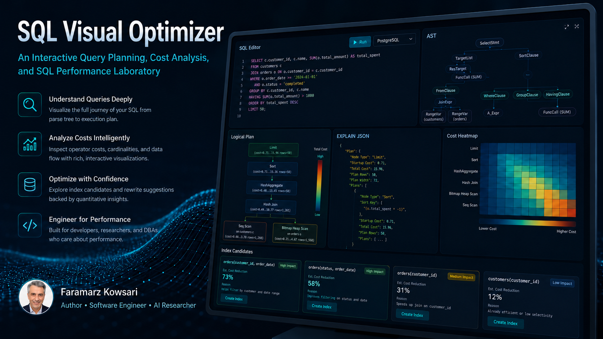

<div align="center">
  

# SQL Visual Optimizer

### An Interactive Query Planning, Cost Analysis, and SQL Performance Laboratory

[](https://doi.org/10.5281/zenodo.21501361)
[](https://github.com/FaramarzKowsari/sql-visual-optimizer/actions/workflows/ci.yml)
[](https://github.com/FaramarzKowsari/sql-visual-optimizer/actions/workflows/deploy-pages.yml)
[](LICENSE)
[](https://www.typescriptlang.org/)
[](crates/query-math)

**Live application:** `https://FaramarzKowsari.github.io/sql-visual-optimizer/`

**Archived release:** `https://doi.org/10.5281/zenodo.21501361`

</div>

<p align="center">
  <a href="https://FaramarzKowsari.github.io/sql-visual-optimizer/" title="Open the live SQL Visual Optimizer laboratory">
    
  </a>
</p>

<p align="center"><sub>Professional interface showcase · Click the image to open the live application</sub></p>

---

SQL Visual Optimizer turns SQL performance analysis into an inspectable visual workflow. It parses queries, builds a transparent educational plan, highlights likely cost centers, detects common anti-patterns, proposes index experiments, and visualizes real PostgreSQL-compatible `EXPLAIN (FORMAT JSON)` output.

The public application runs as static files on GitHub Pages. It requires **no project-owned server, database, paid API, or embedded credential**.

## Canonical project links

Use the following descriptive links when referencing this project from websites, academic profiles, books, or social posts:

- [SQL Visual Optimizer — Interactive Query Planning and Performance Laboratory](https://faramarzkowsari.github.io/sql-visual-optimizer/)
- [SQL Visual Optimizer source code and technical documentation](https://github.com/FaramarzKowsari/sql-visual-optimizer)
- [SQL Visual Optimizer v1.0.0 archived software release on Zenodo](https://doi.org/10.5281/zenodo.21501361)

Avoid generic anchor text such as “Click here.” Consistent descriptive titles help readers and search systems understand the destination before opening it.

## What it can do

- parse PostgreSQL, MySQL, SQLite, and T-SQL syntax;
- display the parser's abstract syntax tree;
- identify tables, aliases, joins, filters, aggregates, sorts, offsets, and limits;
- build a transparent browser-side logical-plan estimate;
- visualize modeled row flow and relative cost heat;
- detect SQL anti-patterns and explain why they matter;
- generate exploratory index candidates from predicates and join keys;
- let users edit table sizes and declared indexes;
- import PostgreSQL-compatible EXPLAIN JSON;
- display actual rows and timing when present in imported plans;
- provide a local rule-based explanation without AI;
- optionally request a Gemini explanation using the visitor's own API key.

## Evidence labels

The application intentionally separates three different things:

| Label | Meaning |
|---|---|
| **Estimated Plan** | A transparent teaching model created in the browser. It is not PostgreSQL's or MySQL's chosen physical plan. |
| **Imported Real Plan** | JSON produced by a database engine and visualized by the application. |
| **AI Explanation** | Optional interpretation produced with the visitor's own Gemini key. It is not execution evidence. |

This distinction is central to the project's scientific integrity.

## Run locally

```bash
npm install
npm run dev
```

Open the local URL printed by Vite.

Production verification:

```bash
npm run test
npm run build
npm run preview
```

## Optional Gemini BYOK mode

The deterministic analyzer works without Gemini. Visitors may paste their own Gemini API key to request a natural-language performance explanation.

Security properties:

- no key is included in the repository;
- the key is stored only in browser `sessionStorage`;
- the key can be erased with **Forget key**;
- requests go directly from the visitor's browser to the provider;
- quotas, billing, and provider terms belong to the key owner.

Do not submit confidential schemas or production queries to an external model without authorization.

## Project structure

```text
sql-visual-optimizer/
├── src/
│   ├── components/          # visual interface
│   ├── data/                # query clinics
│   ├── lib/
│   │   ├── analyzer.ts      # deterministic analysis and plan model
│   │   ├── explain.ts       # imported plan normalization
│   │   └── gemini.ts        # optional BYOK adapter
│   └── types.ts
├── crates/query-math/       # experimental Rust/WASM cost primitives
├── examples/                # SQL and EXPLAIN fixtures
├── benchmarks/              # reproducibility requirements
├── docs/                    # architecture, methodology, research, roadmap
├── public/llms.txt          # concise machine-readable project summary
└── .github/workflows/       # CI and Pages deployment
```

## Current methodology

The browser estimator is deliberately lightweight. It models scans, joins, filters, aggregation, deduplication, sorting, offset, and limit using explicit heuristics and user-provided schema statistics. Relative cost units make structural changes visible; they do not predict production latency.

Read:

- [Architecture](docs/ARCHITECTURE.md)
- [Methodology and limitations](docs/METHODOLOGY.md)
- [Research direction](docs/RESEARCH.md)
- [Roadmap](docs/ROADMAP.md)
- [Discoverability and backlink guide](docs/DISCOVERABILITY_AND_BACKLINKS.md)

## Author

**Faramarz Kowsari** is an author, Software Engineer and AI researcher based in Istanbul. Focusing on the intersection of technology, education, and personal growth, he has published over 80 digital titles on international platforms. His areas of expertise span Artificial Intelligence, prompt engineering, modern trading strategies (Smart Money Concepts & algorithmic trading), as well as classical literature and mindfulness. In addition to writing, he develops web-based educational tools and creates specialized instructional video content.

### Official Profiles & Repositories

- ORCID: https://orcid.org/0000-0003-1692-0453
- Google Scholar: https://scholar.google.com/citations?user=G7tP5WMAAAAJ&hl=en
- GitHub: https://github.com/FaramarzKowsari
- LinkedIn: https://www.linkedin.com/in/faramarzkowsari
- Google Books: https://play.google.com/store/search?q=Faramarz_Kowsari&c=books
- Official Website: https://FaramarzKowsari.github.io
- Zenodo Records: https://zenodo.org/search?q=creators.orcid%3A%220000-0003-1692-0453%22&l=list&p=1&s=10&sort=bestmatch
- Software DOI: https://doi.org/10.5281/zenodo.21501361

## Citation

Please cite the archived `v1.0.0` software release as:

> Kowsari, F. (2026). *SQL Visual Optimizer: An Interactive Query Planning, Cost Analysis, and SQL Performance Laboratory* (Version 1.0.0) [Computer software]. Zenodo. https://doi.org/10.5281/zenodo.21501361

Machine-readable citation metadata is available in [`CITATION.cff`](CITATION.cff).

## License

MIT © 2026 Faramarz Kowsari.
